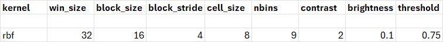

## *HOG* Ordner:
Enthält Visualisierung für das beste HOG Modell\
Modell mit 

## *Neural_Network* Ordner:
Enthält Visualisierung für das beste NN Modell\
Modell: efficientdet_d0_coco17_tpu-32 165'000 Trainingsschritte; 10'000 Aufwärmschritte, Threshold 0.175

## *Segmentierung* Ordner:
Enthält Visualisierung für das beste Segmentierungsmodell\
Modell: DeepLabV3_MobilenetV2 20'000 Trainingsschritte; 100 Aufwärmschritte